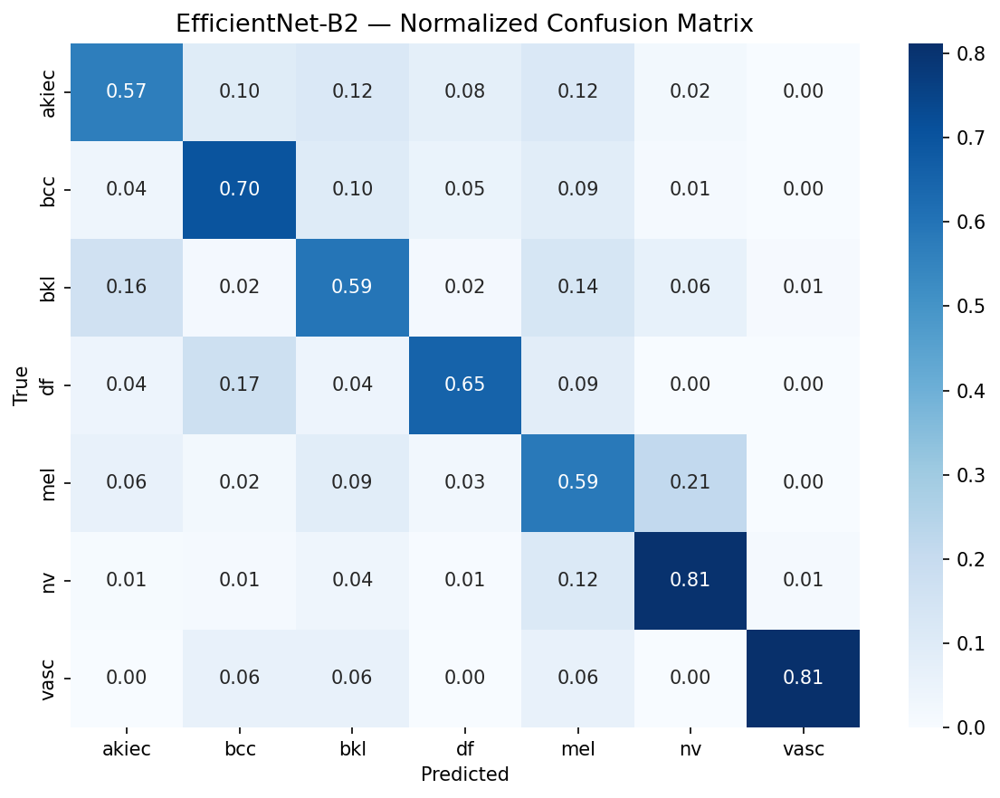
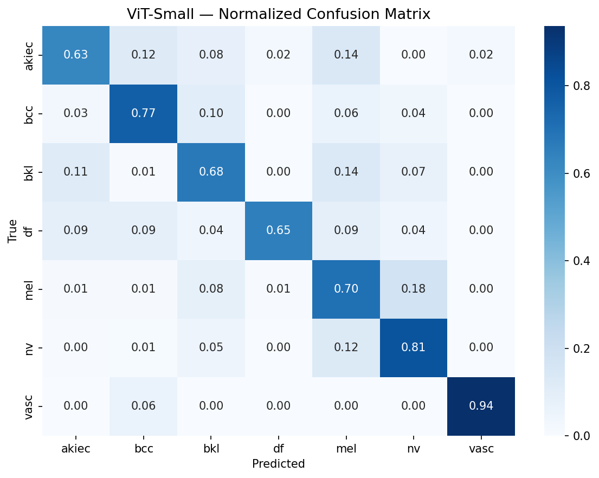
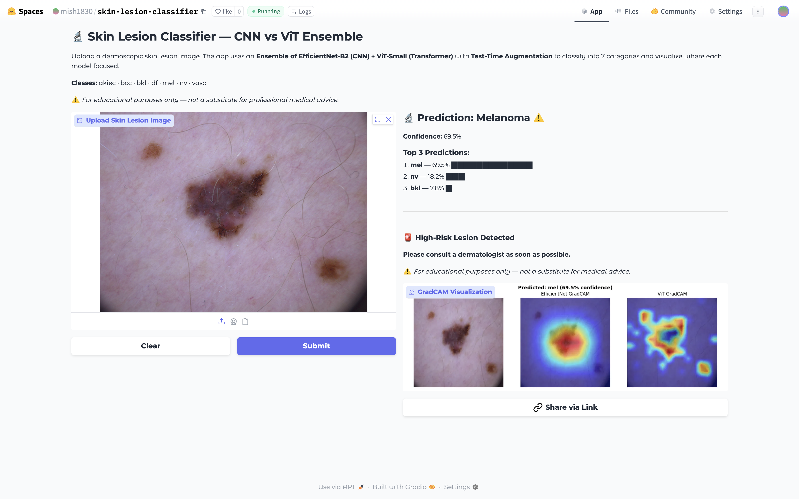

# 🔬 Skin Lesion Classification: CNN vs Vision Transformer

**CS273P Final Project — UC Irvine**

[](https://huggingface.co/spaces/mish1830/skin-lesion-classifier)
[](https://drive.google.com/file/d/17QJzswjxweugf8wZNdH5KmZfB7i1r9rJ/view?usp=sharing)
[](https://www.kaggle.com/datasets/kmader/skin-cancer-mnist-ham10000)

---

## 🌟 Live Demo

**👉 Try the app here: [https://huggingface.co/spaces/mish1830/skin-lesion-classifier](https://huggingface.co/spaces/mish1830/skin-lesion-classifier)**

Upload any dermoscopic skin lesion image and get:
- Prediction from our CNN + ViT Ensemble with confidence score
- Top 3 class probabilities
- GradCAM visualizations showing where each model focused
- Clinical risk assessment (high-risk vs low-risk)

**📹 [Watch the full demo video](https://drive.google.com/file/d/17QJzswjxweugf8wZNdH5KmZfB7i1r9rJ/view?usp=sharing)**

---

## 📋 Project Overview

This project compares two fundamentally different deep learning architectures for skin lesion classification on the HAM10000 dermoscopic dataset:

- **EfficientNet-B2** — a Convolutional Neural Network (CNN) that learns local spatial features through convolutional filters
- **ViT-Small/16** — a Vision Transformer that uses self-attention to capture global relationships across image patches

Beyond the comparison, we implemented:
- **Test-Time Augmentation (TTA)** — showing each image in 5 orientations at inference time
- **Ensemble method** — combining both models' predictions for improved robustness
- **GradCAM interpretability analysis** — visualizing what each model looks at
- **A fully deployed web app** on Hugging Face Spaces

---

## 📊 Dataset: HAM10000

| Property | Value |
|---|---|
| Full name | Human Against Machine with 10000 training images |
| Total images | 10,015 dermoscopic images |
| Classes | 7 skin lesion types |
| Source | Kaggle / ISIC Archive |

### Class Distribution

| Class | Description | Count |
|---|---|---|
| `nv` | Melanocytic Nevi (Mole) | 6,705 |
| `mel` | Melanoma ⚠️ | 1,113 |
| `bkl` | Benign Keratosis | 1,099 |
| `bcc` | Basal Cell Carcinoma | 514 |
| `akiec` | Actinic Keratosis | 327 |
| `df` | Dermatofibroma | 115 |
| `vasc` | Vascular Lesion | 142 |

> ⚠️ **Severe class imbalance**: `nv` (moles) make up 67% of all images. This is why we use **Balanced Accuracy** as our primary metric instead of standard accuracy.

### Data Splits (Patient-Level)

We used **patient-level splitting** based on `lesion_id` to prevent data leakage — the same patient's lesions never appear in both train and test sets. This is a critical methodological choice that most tutorials skip.

| Split | Images |
|---|---|
| Train | 6,987 |
| Validation | 1,512 |
| Test | 1,516 |

---

## 🏗️ Architecture

### EfficientNet-B2 (CNN)
```
Pretrained EfficientNet-B2 (ImageNet)
    └── Custom Classifier Head:
        ├── Dropout(0.5)
        ├── Linear(1408 → 256)
        ├── ReLU
        ├── Dropout(0.3)
        └── Linear(256 → 7)
```

### ViT-Small/16 (Transformer)
```
Pretrained ViT-Small/16 (ImageNet)
    └── Custom Classification Head:
        ├── Dropout(0.5)
        ├── Linear(384 → 256)
        ├── ReLU
        ├── Dropout(0.3)
        └── Linear(256 → 7)
```

### Key Design Choices
- Both models use a **deeper two-layer head** (256-dim hidden layer) instead of a single linear layer
- **Label Smoothing Cross-Entropy** loss to reduce overconfidence
- **Weight decay = 1e-2** for regularization
- **Early stopping** with patience=5 to prevent overfitting

---

## 🔧 Training Configuration

| Hyperparameter | Value |
|---|---|
| Image size | 224 × 224 |
| Batch size | 32 |
| Learning rate | 5e-5 |
| Optimizer | AdamW |
| Weight decay | 1e-2 |
| Loss function | Label Smoothing Cross-Entropy |
| Max epochs | 20 |
| Early stopping patience | 5 |
| Seed | 42 |

### Data Augmentation (Training)
- Random horizontal/vertical flip
- Random rotation (±45°)
- ColorJitter (brightness, contrast, saturation, hue = 0.4)
- RandomAffine (translate, scale, shear)
- RandomErasing (p=0.2)
- Normalize (ImageNet mean/std)

---

## 📈 Results

### Baseline Results

| Model | Val Balanced Acc | Test Balanced Acc | AUC-ROC | Stopped At |
|---|---|---|---|---|
| EfficientNet-B2 | 0.7345 | 0.6744 | 0.9411 | Epoch 17/20 |
| **ViT-Small** | **0.7534** | **0.7211** | **0.9429** | Epoch 15/20 |

**ViT-Small wins by +0.0467 balanced accuracy points on the test set.**

### Training Curves


- EfficientNet: Train 0.78 → Val 0.73 (~6% gap, minimal overfitting)
- ViT: Train 0.90 → Val 0.75 (~15% gap, mild overfitting acceptable for medical imaging with class imbalance)

### Per-Class Test Results

| Class | EfficientNet-B2 | ViT-Small | Winner |
|---|---|---|---|
| akiec | 0.57 | 0.63 | ViT ✅ |
| bcc | 0.70 | 0.77 | ViT ✅ |
| bkl | 0.59 | 0.68 | ViT ✅ |
| df | 0.65 | 0.65 | Tied |
| mel | 0.59 | 0.70 | ViT ✅ |
| nv | 0.81 | 0.81 | Tied |
| vasc | 0.81 | 0.94 | ViT ✅ |

ViT beats EfficientNet on every class except df (tied).

### Confusion Matrices

| EfficientNet-B2 | ViT-Small |
|---|---|
|  |  |

---

## 🔬 Ablation Study

| Method | Balanced Accuracy |
|---|---|
| EfficientNet Frozen (no fine-tuning) | 0.481 |
| EfficientNet Fine-tuned | 0.734 (+0.253) |
| ViT Fine-tuned | 0.753 (+0.272) |

Fine-tuning is essential — frozen pretrained features alone are insufficient for medical imaging.

---

## 🚀 TTA + Ensemble Results

We applied **Test-Time Augmentation** (5 orientations: original, H-flip, V-flip, 90°, 270°) and an **Ensemble** of both models:


| Method | Balanced Accuracy | AUC-ROC |
|---|---|---|
| EfficientNet-B2 (baseline) | 0.6744 | 0.9411 |
| ViT-Small (baseline) | 0.7211 | 0.9429 |
| EfficientNet-B2 + TTA | 0.6871 | 0.9493 |
| ViT-Small + TTA | 0.7374 | 0.9468 |
| **Ensemble + TTA** | 0.7233 | **0.9565** |

**Key finding:** The Ensemble + TTA achieves the **best AUC-ROC (0.9565)**, meaning it is the most reliable for ranking predictions — critical for clinical screening tools. ViT+TTA achieves the best balanced accuracy (0.7374).

> This reveals an important tradeoff: ViT+TTA is best for per-class accuracy, but the Ensemble+TTA is most suitable for clinical screening where ranking confidence matters more than hard classification.

---

## 🧠 GradCAM Interpretability


| Model | Attention Pattern | Implication |
|---|---|---|
| EfficientNet | Focuses on **one central blob** | Local CNN receptive fields |
| ViT | **Scattered across multiple patches** globally | Transformer self-attention captures context |

This explains why ViT performs better on minority classes — it captures more contextual information rather than focusing on a single region.

### Demo Examples

| Melanoma (High-Risk) | Melanocytic Nevi (Low-Risk) |
|---|---|
|  |  |

---

## 🌐 Web Application

We built and deployed a **fully functional medical AI demo** on Hugging Face Spaces.

**Live at: [https://huggingface.co/spaces/mish1830/skin-lesion-classifier](https://huggingface.co/spaces/mish1830/skin-lesion-classifier)**

### Features
- Upload any dermoscopic image
- Runs Ensemble (EfficientNet + ViT) with TTA
- Shows top 3 predictions with confidence bars
- 🚨 High-risk alert for melanoma, BCC, actinic keratosis
- ⚠️ Low-confidence warning → "See a doctor"
- ✅ Low-risk confirmation for benign lesions
- Side-by-side GradCAM visualization for both models

---

## 📁 Repository Structure

```
skin-lesion-classifier/
├── step1_install.py          # Install packages, download dataset
├── step2_data.py             # Data loading, augmentation, patient-level splits
├── step3_models.py           # Model definitions (EfficientNet + ViT)
├── step4_training.py         # Training loop, early stopping, label smoothing
├── step5_train.py            # Train both models
├── step6_ablation.py         # Frozen vs fine-tuned ablation study
├── step7_evaluate.py         # Test evaluation, confusion matrices
├── step8_gradcam.py          # GradCAM visualizations
├── ensemble_tta.py           # TTA + Ensemble evaluation
├── kaggle_complete.py        # Single-file version for Kaggle
├── app.py                    # Gradio web app (Hugging Face Spaces)
├── requirements.txt          # Python dependencies
└── results/
    ├── training_curves-2.png
    ├── confusion_matrix_EfficientNet-B2.png
    ├── confusion_matrix_ViT-Small.png
    ├── gradcam_comparison.png
    ├── ensemble_tta_comparison.png
    ├── Melanoma.png
    └── Melanocytic Nevi.png
```

---

## 🚀 How to Run

### Option 1: Kaggle (Recommended — Free GPU)

1. Go to [Kaggle.com](https://kaggle.com) and create a notebook
2. Add the HAM10000 dataset: `kmader/skin-cancer-mnist-ham10000`
3. Enable GPU accelerator (T4 x2)
4. Upload `kaggle_complete.py` and run all cells
5. Training takes ~45 minutes on T4 GPU

### Option 2: Local (Mac/Linux)

```bash
# Clone the repo
git clone https://github.com/pmanickam2910/CS-273P-Final-Project.git
cd CS-273P-Final-Project

# Install dependencies
pip install -r requirements.txt

# Download dataset
python step1_install.py

# Prepare data
python step2_data.py

# Train both models
python step5_train.py

# Run ablation study
python step6_ablation.py

# Evaluate on test set
python step7_evaluate.py

# Generate GradCAM visualizations
python step8_gradcam.py

# Run TTA + Ensemble
python ensemble_tta.py
```

### Option 3: Run the Web App Locally

```bash
pip install gradio timm grad-cam torch torchvision
python app.py
# Open http://localhost:7860
```

---

## 📦 Dependencies

```
torch
torchvision
timm
gradio
grad-cam
Pillow
numpy
matplotlib
scikit-learn
pandas
kagglehub
```

---

## 🔑 Key Contributions

1. **Patient-level data splitting** — prevents data leakage by ensuring the same patient's lesions never appear in both train and test sets
2. **Clinically motivated evaluation** — balanced accuracy and AUC-ROC instead of standard accuracy, reflecting real-world class imbalance
3. **Interpretability analysis** — GradCAM comparison revealing fundamentally different attention patterns between CNN and ViT
4. **TTA + Ensemble** — systematic improvement showing ensemble achieves best AUC-ROC while ViT+TTA achieves best balanced accuracy
5. **End-to-end deployment** — fully working web app anyone can use

---

## 👥 Team

| Name |
|---|---|
| Mishika Ahuja | 
| Praavin Kumar |
| Venkat Swaroop |

**Course:** CS273P — Machine Learning in Healthcare  
**Institution:** UC Irvine  
**Year:** 2026

---

## ⚠️ Disclaimer

This project is for **educational purposes only**. It is not a substitute for professional medical advice, diagnosis, or treatment. Always consult a qualified dermatologist for skin lesion evaluation.

---

## 📚 References

- Tschandl, P., Rosendahl, C., & Kittler, H. (2018). The HAM10000 dataset. *Scientific Data*
- Tan, M., & Le, Q. (2019). EfficientNet: Rethinking Model Scaling for CNNs. *ICML*
- Dosovitskiy, A., et al. (2020). An Image is Worth 16x16 Words: Transformers for Image Recognition at Scale. *ICLR*
- Selvaraju, R. R., et al. (2017). Grad-CAM: Visual Explanations from Deep Networks. *ICCV*
