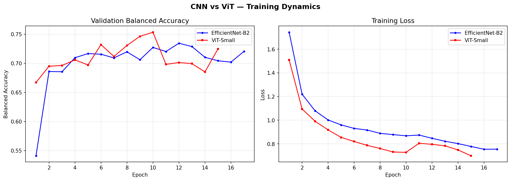
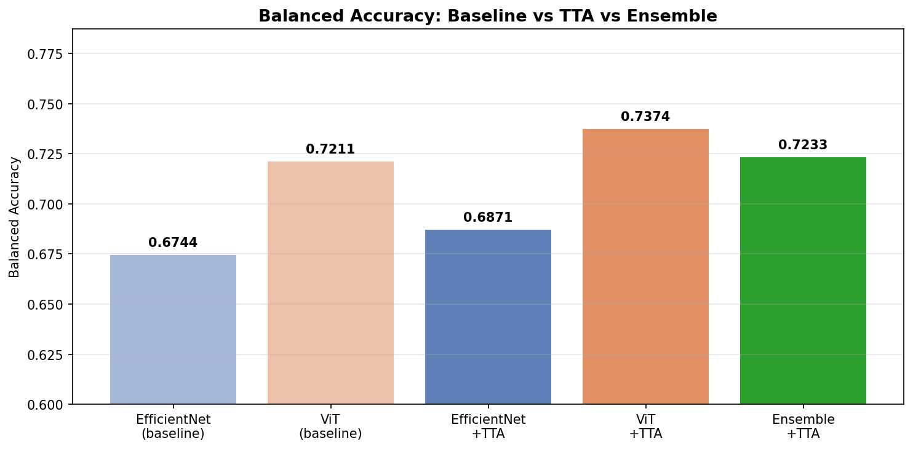

# 🔬 Skin Lesion Classification: CNN vs Vision Transformer

**CS273P Final Project — UC Irvine**

[](https://huggingface.co/spaces/mish1830/skin-lesion-classifier)
[](https://drive.google.com/file/d/17QJzswjxweugf8wZNdH5KmZfB7i1r9rJ/view?usp=sharing)
[](https://www.kaggle.com/datasets/kmader/skin-cancer-mnist-ham10000)

---

## 🌟 Live Demo

**👉 Try the app here: [https://huggingface.co/spaces/mish1830/skin-lesion-classifier](https://huggingface.co/spaces/mish1830/skin-lesion-classifier)**

Upload any dermoscopic skin lesion image and get:
- Prediction from our CNN + ViT Ensemble with confidence score
- Top 3 class probabilities
- GradCAM visualizations showing where each model focused
- Clinical risk assessment (high-risk vs low-risk)

**📹 [Watch the full demo video](https://drive.google.com/file/d/17QJzswjxweugf8wZNdH5KmZfB7i1r9rJ/view?usp=sharing)**

---

## 📋 Project Overview

This project compares two fundamentally different deep learning architectures for skin lesion classification on the HAM10000 dermoscopic dataset:

- **EfficientNet-B2** — a Convolutional Neural Network (CNN) that learns local spatial features through convolutional filters
- **ViT-Small/16** — a Vision Transformer that uses self-attention to capture global relationships across image patches

Beyond the comparison, we implemented:
- **Test-Time Augmentation (TTA)** — showing each image in 5 orientations at inference time
- **Ensemble method** — combining both models' predictions for improved robustness
- **GradCAM interpretability analysis** — visualizing what each model looks at
- **A fully deployed web app** on Hugging Face Spaces

---

## 📊 Dataset: HAM10000

| Property       | Value                                  |
|----------------|----------------------------------------|
| Full name      | Human Against Machine with 10000 training images |
| Total images   | 10,015 dermoscopic images              |
| Classes        | 7 skin lesion types                    |
| Source         | Kaggle / ISIC Archive                  |

### Class Distribution

| Class    | Description                  | Count | Clinical Risk |
|----------|------------------------------|-------|---------------|
| `nv`     | Melanocytic Nevi (Mole)      | 6,705 | Low           |
| `mel`    | Melanoma ⚠️                  | 1,113 | **High**      |
| `bkl`    | Benign Keratosis             | 1,099 | Low           |
| `bcc`    | Basal Cell Carcinoma         | 514   | **High**      |
| `akiec`  | Actinic Keratosis            | 327   | **High**      |
| `df`     | Dermatofibroma               | 115   | Low           |
| `vasc`   | Vascular Lesion              | 142   | Low           |

> ⚠️ **Severe class imbalance**: `nv` (moles) make up 67% of all images. This is why we use **Balanced Accuracy** as our primary metric instead of standard accuracy.

### Data Splits (Patient-Level)

We used **patient-level splitting** based on `lesion_id` to prevent data leakage — the same patient's lesions never appear in both train and test sets.

| Split      | Images |
|------------|--------|
| Train      | 6,987  |
| Validation | 1,512  |
| Test       | 1,516  |

---

## 🏗️ Architecture

### EfficientNet-B2 (CNN)

```
Pretrained EfficientNet-B2 (ImageNet)
    └── Custom Classifier Head:
        ├── Dropout(0.5)
        ├── Linear(1408 → 256)
        ├── ReLU
        ├── Dropout(0.3)
        └── Linear(256 → 7)
```

### ViT-Small/16 (Transformer)

```
Pretrained ViT-Small/16 (ImageNet)
    └── Custom Classification Head:
        ├── Dropout(0.5)
        ├── Linear(384 → 256)
        ├── ReLU
        ├── Dropout(0.3)
        └── Linear(256 → 7)
```

### Key Design Choices

| Choice                          | Reason                                                     |
|---------------------------------|------------------------------------------------------------|
| Two-layer classification head   | More expressive than single linear layer                   |
| Label Smoothing Cross-Entropy   | Reduces overconfidence on majority class                   |
| Weight decay = 1e-2             | Strong L2 regularization to reduce overfitting             |
| Early stopping (patience = 5)   | Stops training before val accuracy degrades                |
| Balanced accuracy metric        | Prevents model from ignoring minority classes              |

---

## 🔧 Training Configuration

| Hyperparameter         | Value                           |
|------------------------|---------------------------------|
| Image size             | 224 × 224                       |
| Batch size             | 32                              |
| Learning rate          | 5e-5                            |
| Optimizer              | AdamW                           |
| Weight decay           | 1e-2                            |
| Loss function          | Label Smoothing Cross-Entropy   |
| Label smoothing ε      | 0.1                             |
| Max epochs             | 20                              |
| Early stopping patience| 5                               |
| Scheduler              | Cosine Annealing Warm Restarts  |
| Gradient clipping      | max norm = 1.0                  |
| Random seed            | 42                              |

### Data Augmentation (Training Only)

| Augmentation         | Parameters                              | Reason                                    |
|----------------------|-----------------------------------------|-------------------------------------------|
| Random H/V Flip      | p = 0.5                                 | Lesions have no canonical orientation     |
| Random Rotation      | ±45°                                    | Dermoscopes can be held at any angle      |
| ColorJitter          | brightness/contrast/saturation/hue=0.4  | Accounts for inter-device variability     |
| RandomAffine         | translate, scale, shear                 | Perspective variation                     |
| RandomErasing        | p = 0.2                                 | Prevents relying on single salient patch  |
| Normalize            | ImageNet mean/std                       | Consistent with pretrained weights        |

---

## 📈 Results

### Baseline Comparison

| Model              | Val Balanced Acc | Test Balanced Acc | AUC-ROC | Stopped At  |
|--------------------|------------------|-------------------|---------|-------------|
| EfficientNet-B2    | 0.7345           | 0.6744            | 0.9411  | Epoch 17/20 |
| **ViT-Small/16**   | **0.7534**       | **0.7211**        | **0.9429** | Epoch 15/20 |
| ViT Improvement    | +0.019           | +0.047            | +0.002  | 2 epochs faster |

**ViT-Small wins by +0.0467 balanced accuracy points on the test set.**

### Per-Class Recall (Test Set)

| Class   | EfficientNet-B2 | ViT-Small | Winner     |
|---------|-----------------|-----------|------------|
| akiec   | 0.57            | 0.63      | ViT ✅     |
| bcc     | 0.70            | 0.77      | ViT ✅     |
| bkl     | 0.59            | 0.68      | ViT ✅     |
| df      | 0.65            | 0.65      | Tied       |
| mel     | 0.59            | 0.70      | ViT ✅ (+0.11) |
| nv      | 0.81            | 0.81      | Tied       |
| vasc    | 0.81            | 0.94      | ViT ✅     |

> ⚠️ **Melanoma recall (+0.11)** is the most clinically significant result — in a 1,000-patient screening, ViT correctly identifies 110 additional melanoma cases.

### Training Curves



---

## 🔬 Ablation Study

| Model Variant                        | Val Balanced Acc | Delta vs Frozen |
|--------------------------------------|------------------|-----------------|
| EfficientNet-B2 (Frozen Backbone)    | 0.481            | —               |
| EfficientNet-B2 (Full Fine-Tune)     | 0.734            | +0.253          |
| ViT-Small/16 (Full Fine-Tune)        | 0.753            | +0.272          |

**Key finding:** Fine-tuning is non-negotiable. Frozen ImageNet features alone are insufficient for dermoscopic classification (+0.253 gain from fine-tuning).

---

## 🚀 TTA + Ensemble Results

We applied **Test-Time Augmentation** (5 orientations: original, H-flip, V-flip, 90°, 270°) and an **Ensemble** of both models:

| Method                  | Balanced Acc | AUC-ROC | Best For                    |
|-------------------------|--------------|---------|-----------------------------|
| EfficientNet-B2         | 0.6744       | 0.9411  | Baseline                    |
| ViT-Small/16            | 0.7211       | 0.9429  | Baseline                    |
| EfficientNet-B2 + TTA   | 0.6871       | 0.9493  | —                           |
| ViT-Small/16 + TTA      | **0.7374**   | 0.9468  | Automated triage            |
| **Ensemble + TTA**      | 0.7233       | **0.9565** | Physician risk scoring   |

> **Key tradeoff:** ViT+TTA achieves best per-class accuracy. Ensemble+TTA achieves best AUC-ROC — most reliable for ranking predictions in clinical screening.



---

## 🧠 GradCAM Interpretability

| Model          | Attention Pattern                        | Implication                                    |
|----------------|------------------------------------------|------------------------------------------------|
| EfficientNet   | Focuses on **one central blob**          | Local CNN receptive fields                     |
| ViT            | **Distributed across multiple patches** | Transformer self-attention captures global context |

ViT's distributed attention naturally aligns with the clinical **ABCDE criteria** (Asymmetry, Border, Color, Diameter, Evolution) — all of which require global multi-region reasoning across the full lesion.


---

## 🌐 Web Application

**Live at: [https://huggingface.co/spaces/mish1830/skin-lesion-classifier](https://huggingface.co/spaces/mish1830/skin-lesion-classifier)**

### Features

| Feature                        | Description                                              |
|--------------------------------|----------------------------------------------------------|
| Ensemble inference             | Runs both EfficientNet + ViT with TTA automatically      |
| Top-3 predictions              | Shows confidence bars for top 3 classes                  |
| 🚨 High-risk alert             | Triggered for melanoma, BCC, actinic keratosis           |
| ⚠️ Low-confidence warning      | Shown when top probability < 50% — "See a doctor"        |
| ✅ Low-risk confirmation       | Shown for confidently predicted benign lesions           |
| GradCAM side-by-side           | Both models' heatmaps shown simultaneously               |

---

## 📁 Repository Structure

```
skin-lesion-classifier/
├── step1_install.py          # Install packages, download dataset
├── step2_data.py             # Data loading, augmentation, patient-level splits
├── step3_models.py           # Model definitions (EfficientNet + ViT)
├── step4_training.py         # Training loop, early stopping, label smoothing
├── step5_train.py            # Train both models
├── step6_ablation.py         # Frozen vs fine-tuned ablation study
├── step7_evaluate.py         # Test evaluation, confusion matrices
├── step8_gradcam.py          # GradCAM visualizations
├── ensemble_tta.py           # TTA + Ensemble evaluation
├── kaggle_complete.py        # Single-file version for Kaggle
├── app.py                    # Gradio web app (Hugging Face Spaces)
├── requirements.txt          # Python dependencies
└── results/
    ├── training_curves-2.png
    ├── confusion_matrix_EfficientNet-B2.png
    ├── confusion_matrix_ViT-Small.png
    ├── gradcam_comparison.png
    ├── ensemble_tta_comparison.png
    ├── Melanoma.png
    └── Melanocytic Nevi.png
```

---

## 🚀 How to Run

### Option 1: Kaggle (Recommended — Free GPU)

1. Go to [Kaggle.com](https://kaggle.com) and create a notebook
2. Add the HAM10000 dataset: `kmader/skin-cancer-mnist-ham10000`
3. Enable GPU accelerator (T4 x2)
4. Upload `kaggle_complete.py` and run all cells
5. Training takes ~45 minutes on T4 GPU

### Option 2: Google Colab

1. Open the demo notebook in Colab
2. Enable GPU runtime (Runtime → Change runtime type → T4 GPU)
3. Run all cells — kagglehub handles dataset download automatically

### Option 3: Local (Mac/Linux)

```bash
# Clone the repo
git clone https://github.com/pmanickam2910/CS-273P-Final-Project.git
cd CS-273P-Final-Project

# Install dependencies
pip install -r requirements.txt

# Download dataset
python step1_install.py

# Prepare data
python step2_data.py

# Train both models
python step5_train.py

# Run ablation study
python step6_ablation.py

# Evaluate on test set
python step7_evaluate.py

# Generate GradCAM visualizations
python step8_gradcam.py

# Run TTA + Ensemble
python ensemble_tta.py
```

### Option 4: Run the Web App Locally

```bash
pip install gradio timm grad-cam torch torchvision
python app.py
# Open http://localhost:7860
```

---

## 📦 Dependencies

```
torch
torchvision
timm
gradio
grad-cam
Pillow
numpy
matplotlib
scikit-learn
pandas
kagglehub
```

Install all at once:
```bash
pip install -r requirements.txt
```

---

## 📝 Code Attribution

| Component                        | Source                                      |
|----------------------------------|---------------------------------------------|
| EfficientNet-B2 weights          | `timm` library (pretrained on ImageNet)     |
| ViT-Small/16 weights             | `timm` library (pretrained on ImageNet-21k) |
| GradCAM implementation           | `pytorch-grad-cam` library                  |
| Training loop                    | Written from scratch                        |
| Patient-level splitting          | Written from scratch                        |
| Label smoothing loss             | Written from scratch                        |
| Weighted random sampler          | PyTorch built-in, configured from scratch   |
| Web application                  | Written from scratch using Gradio           |

---

## 🔑 Key Contributions

1. **Patient-level data splitting** — prevents data leakage by ensuring the same patient's lesions never appear in both train and test sets
2. **Clinically motivated evaluation** — balanced accuracy and AUC-ROC instead of standard accuracy, reflecting real-world class imbalance
3. **Interpretability analysis** — GradCAM comparison revealing fundamentally different attention patterns between CNN and ViT, linked to ABCDE clinical criteria
4. **TTA + Ensemble** — systematic improvement showing ensemble achieves best AUC-ROC while ViT+TTA achieves best balanced accuracy
5. **End-to-end deployment** — fully working web app anyone can use without any setup

---

## 👥 Team

| Name | Email |
|------|-------|
|      |       |
|      |       |
|      |       |

**Course:** CS273P — Machine Learning in Healthcare  
**Institution:** UC Irvine  
**Year:** 2026

---

## 🏥 Clinical Threshold Justification

The web application flags a **low-confidence warning when the top predicted probability falls below 50%**. This threshold was chosen as a conservative default, but it has important clinical implications worth understanding.

### Why Threshold Matters in Medical AI

| Error Type | What Happens | Clinical Cost |
|---|---|---|
| False Positive | Predicted melanoma, lesion is benign | Unnecessary biopsy — stressful and expensive |
| False Negative | Missed melanoma, predicted benign | Delayed treatment — potentially fatal |

In cancer screening, **false negatives are far more costly than false positives.** A missed melanoma can mean the difference between a 98% and 25% five-year survival rate.

### Why 50% May Be Too High for Clinical Use

| Threshold | Effect | Clinical Implication |
|---|---|---|
| 50% (current) | Only flags uncertainty when model is genuinely unsure | May miss borderline malignant cases |
| 30–35% (recommended) | Flags more cases for review | More referrals but fewer missed cancers |
| 20% (aggressive) | Flags almost everything | Too many unnecessary referrals |

A clinically conservative deployment would lower this threshold to **30–35%** to prioritize recall over precision for high-risk classes (melanoma, BCC, actinic keratosis). The 50% threshold used here is appropriate for a demonstration application but should be recalibrated with clinical input before any real deployment.

> **Future work:** Precision-recall curve analysis per class to select clinically optimal thresholds, with asymmetric cost weighting for high-risk vs low-risk classes.

---

## ⚠️ Disclaimer

This project is for **educational purposes only**. It is not a substitute for professional medical advice, diagnosis, or treatment. Always consult a qualified dermatologist for skin lesion evaluation.

---

## 📚 References

- Tschandl, P., Rosendahl, C., & Kittler, H. (2018). The HAM10000 dataset. *Scientific Data*
- Tan, M., & Le, Q. (2019). EfficientNet: Rethinking Model Scaling for CNNs. *ICML*
- Dosovitskiy, A., et al. (2020). An Image is Worth 16x16 Words: Transformers for Image Recognition at Scale. *ICLR*
- Selvaraju, R. R., et al. (2017). Grad-CAM: Visual Explanations from Deep Networks. *ICCV*
- Loshchilov, I., & Hutter, F. (2019). Decoupled Weight Decay Regularization. *ICLR*
